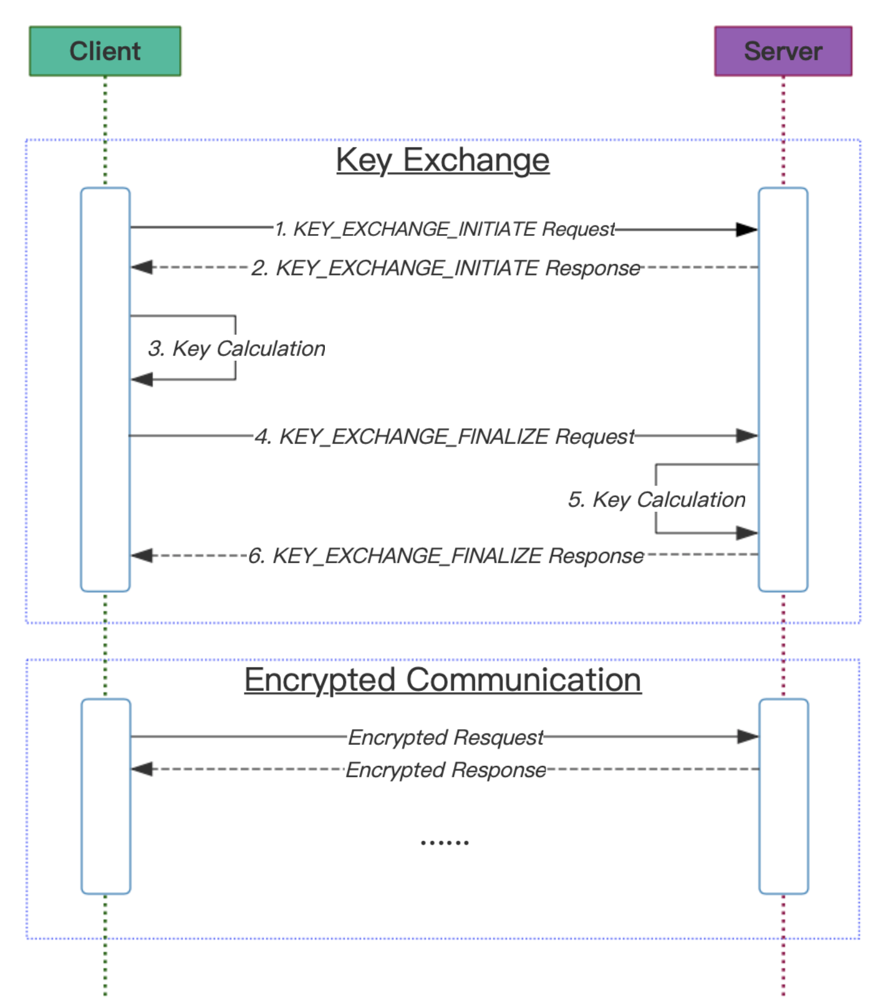

# openssl-key-exchange


## 简介
该方案介绍一种通过ECDH椭圆曲线算法进行密钥交换的流程和方法，这种方案可以在的不安全的通信场景下进行AES密钥协商，即使有第三者监听到了所有的密钥交换信息，也无法获知最终计算出的AES密钥，防止MITM（Man-in-the-middle attack 中间人攻击）。

这种方案可典型的应用于蓝牙BLE Peripheral 跟 Central 间的密钥协商，但是本文更多的聚焦在密钥交换流程和原理上，而非具体的应用场景，所以只是抽象成了Client和Server两种角色。\
Client和Server之间通过[rpclib](https://github.com/rpclib/rpclib)进行通信，Server提供了某些服务，可被Client进行远程访问。\
一个Server至少提供两个服务，一个是密钥交换服务，另一个是加密后的数据通信服务。在这个项目中，我们的 Server 通过 rpclib 绑定了两个服务：
1. "key_exchange_request", Client访问该服务完成密钥交换。
2. "encrypted_request", Client在密钥交换完成后使用加密过的数据访问该服务。

Server和Client之间传输的消息使用protobuf，协议定义参考[key_exchange.proto](./protos/key_exchange.proto)

## 构建&运行
目前已经在Ubuntu和MacOS上做了验证，需要主机安装openssl库和protobuf3.0+库

```shell
$ git clone https://github.com/zhoupeng6d/openssl-key-exchange.git
$ cd openssl-key-exchange
$ git submodule init
$ mkdir build
$ cmake ..
$ make
$ ./server
$ ./client # run the client in another terminal window
```
## 目录结构
```C++
.
├── CMakeLists.txt                  // cmake 构建文件
├── LICENSE                         // 项目开源许可
├── README.md                       // 程序说明
├── README_CN.md                    // 程序说明中文版
├── README_EN.md                    // 程序说明英文版
├── deps                            // 依赖的第三方库目录
├── protos
│   └── key_exchange.proto          // 协议定义文件
├── readme_images
└── src
    ├── client.cc                   // Client 主程序源码
    ├── common.h                    // 公共函数头文件源码
    ├── crypto.cc                   // 基于openssl封装的密钥交换和加解密函数包
    ├── crypto.h                    // 加解密函数包头文件
    ├── hex_dump.h                  // 二进制dump
    └── server.cc                   // Server 主程序源码
```

## 项目中用到的算法标准：
1. ECDH (Elliptic-Curve Diffie–Hellman NIST P-256)
2. HKDF (HMAC-based Extract-and-Expand Key Derivation Function  Refer to RFC 5869)
3. HMAC (Hash-based Message Authentication Code SHA-256)
4. AES  (AES-256-GCM)


## 流程图
<div align=center></div>

**该流程包含两个主要的阶段**
1. Key Exchange阶段，密钥交换，最终协商出一个AES对称密钥；
2. Encrypted Communication阶段，使用上一步协商出的密钥进行AES加密通信；

### Key Exchange阶段
1. KEY_EXCHANGE_INITIATE Request，Client将自己的ECDH公钥（65字节）和Salt(32字节随机数)发送给Server；
2. KEY_EXCHANGE_INITIATE Response，Server将自己的ECDH公钥（65字节）和Salt(32字节随机数)发送给Client；
3. Key Calculation，Client端收到Server端在上一步发过来的消息后，使用key_calculate()函数计算AES密钥（32字节）；
4. KEY_EXCHANGE_FINALIZE Request，当Client正确的计算出了AES密钥，发送该消息通知Server完成密钥交换；
5. Key Calculation，Server端收到Client端在上一步发过来的消息后，同样适用key_calculate()函数计算AES密钥；
6. KEY_EXCHANGE_FINALIZE Response，Server端的密钥计算完成后，回复OK给Client端，这样就完成了整个密钥交换流程；

#### key_calculate()函数计算步骤
1. 将自己的Salt和对方的Salt进行XOR运算，生成一个XorSalt（32字节）；
2. 使用自己的ECDH公钥+私钥，以及对方的ECDH公钥，通过ECDH算法计算出一个共享密钥SharedKey（32字节）；
3. 使用第一步的XorSalt和第二步的SharedKey，并使用固定的字符串"ENCRYPTION"作为Info输入，使用HKDF算法计算出最终的AES密钥；

### Encrypted Communication阶段
1. Token生成，每次通信时生成一个3字节的随机数，用这个随机数和自己的ECDH公钥，使用HMAC算法计算出一个哈希值，我们称之为Token。
2. 将上一步的随机数和Token插入Encrypted Request中，以及加密后的Ciphertext一并发给Server；
3. Server收到Encrypted Request后，根据保存的密钥交换过的设备公钥和Client发过来的随机数，计算出一个Token，如果跟Client发过来的Token一致，那就认为该设备是一个受信设备，并解密接下来的Ciphertext；

## 设备合法性校验（本项目不做实现）
如果你理解了上面的密钥交换流程，那么你肯定发现了一个问题，就是任何Client都可以用同样的一套机制跟Server进行通信，显然我们的目的不是实现一种[隐蔽式安全](http://www.ituring.com.cn/book/miniarticle/129179)算法。\
要实现设备的合法性校验，就要将双方的公钥提前录入到对方设备中，或者将公钥录入到一个双方都能访问的鉴权服务器中。需要提前录入的信息可以通过计算设备公钥的哈希来实现。\
根据上面的流程图，我们可以在步骤1（Server收到Client的KEY_EXCHANGE_INITIATE Request）和步骤2（Client收到Server的KEY_EXCHANGE_INITIATE Response）后面分别加入公钥验证流程，这样Client和Server就可以相互验证对方的身份，如果对方的身份跟预留信息不相符，那就拒绝他的密钥交换请求。

## 蓝牙配对应用
如果要把这套机制应用在蓝牙主从设备之间，一般是由蓝牙从设备来提供相应的服务供主机访问，那么，蓝牙从设备作为Server角色，蓝牙主设备作为Client角色；

从设备至少提供两个Service UUID，一个负责密钥交换服务，另一个负责数据加密通信；\
为了实现Request和Response，每个Service UUID下面至少实现两个通道，一个用来接收Request（write属性），一个用来发送Response(Notify属性)，一个典型的Profile例子如下：
```
├──UUID 0xFF10        // Primary Service -- Key Exchange
│  ├── UUID 0xFFF1    // Write Characteristic
│  └── UUID 0xFFF2    // Notify Characteristic
│
└──UUID 0xFF20        // Primary Service -- Encrypted Communication
   ├── UUID 0xFFF1    // Write Characteristic
   └── UUID 0xFFF2    // Notify Characteristic
```
在本工程的代码中，Client在经过了 KeyExchange 之后会在每一次的 EncryptedRequest 中加入一个 Token，以用来标识自己的身份。但如果是蓝牙设备，Token 由从设备（Server）来生成，Token可以放在从设备广播包的 manufacturer 字段中，这样的话，无需建立连接，就可以判断设备是否经过了密钥交换。

 0 | Flag(0xFF)
---|--------
 1 | Length
2-4|  Salt
5-7|  HMAC

## 鸣谢
本项目基于以下非常优秀的项目构建，排名无先后：\
[rpclib](https://github.com/rpclib/rpclib)\
[openssl](https://github.com/openssl/openssl)\
[protobuf](https://github.com/protocolbuffers/protobuf)
